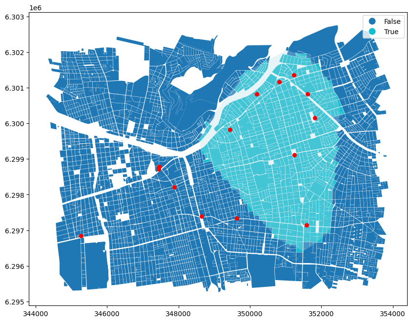

# Introducción

Este trabajo tiene como objetivo identificar zonas prioritarias para la instalación de nueva oferta de leche vegetal en el Gran Santiago, a partir de un modelo de predicción de gasto individual, su microsimulación espacial y el cruce con la oferta actual. Se utilizaron datos de la EPF, CASEN 2022, CENSO 2017, y una base georreferenciada de tiendas reales. El análisis combinó modelación estadística (modelo logit y lineal), microsimulación con `rakeR`, generación de isócronas, análisis espacial de cobertura y clustering territorial.

# Desarrollo

## 1. Preparación de datos y análisis exploratorio

Esta sección presenta la limpieza de datos de la EPF, la identificación de consumidores de leche vegetal, y una primera exploración visual del ingreso y gasto. Se crean variables como ingreso per cápita, escolaridad y edad categorizada.

```{r preparación y analisis exploratorio, echo=TRUE, message=FALSE, warning=FALSE}
# -----------------------------
# 1. Librerías
# -----------------------------
library(haven)       # Lectura de archivos .dta
library(pROC)        # Curva ROC
library(mgcv)        # Modelos GAM (si se desea extender)
library(ggplot2)     # Visualización
library(data.table)  # Manipulación eficiente
library(scales)      # Etiquetas y formatos numéricos
library(rakeR)       # Microsimulación espacial
library(DBI)         # Conexión a bases de datos
library(RPostgres)   # Conexión a PostgreSQL
library(sf)          # Datos espaciales
library(dplyr)       # Pipes y manipulación tidy
library(tidyr)       # Replace_na
library(factoextra)
library(RColorBrewer)
library(here)


# -----------------------------
# 2. Carga de datos EPF
# -----------------------------
personas   <- read_dta(here("data/datos_epf/base-personas-ix-epf-stata.dta"))
gastos     <- read_dta(here("data/datos_epf/base-gastos-ix-epf-stata.dta"))
cantidades <- read_dta(here("data/datos_epf/base-cantidades-ix-epf-stata.dta"))
ccif       <- read_dta(here("data/datos_epf/ccif-ix-epf-stata.dta"))

# -----------------------------
# 3. Preparación de Base EPF, filto de Gran Santiago
# y limpieza
# -----------------------------
valores_invalidos <- c(-99, -88, -77)
personas_gs <- subset(
  personas,
  macrozona == 2 &
    !(edad %in% valores_invalidos) &
    !(edue %in% valores_invalidos) &
    ing_disp_hog_hd_ai >= 0
)
personas_gs$ing_pc <- personas_gs$ing_disp_hog_hd_ai / personas_gs$npersonas
personas_gs$id_persona <- paste(personas_gs$folio, personas_gs$n_linea, sep = "_")
cantidades$id_persona <- paste(cantidades$folio, cantidades$n_linea, sep = "_")

# Filtro del producto: Leche Vegetal (LECHE DE ORIGEN NO ANIMAL)
cantidades_lecheveg <- subset(cantidades, ccif == "01.1.4.04.01" & macrozona == 2)
gasto_lecheveg <- aggregate(gasto ~ id_persona, data = cantidades_lecheveg, sum)
names(gasto_lecheveg)[2] <- "gasto_lecheveg"

# Unir con PERSONAS y crear variable binaria (gasto)
personas_gs <- merge(personas_gs, gasto_lecheveg, by = "id_persona", all.x = TRUE)
personas_gs$gasto_lecheveg[is.na(personas_gs$gasto_lecheveg)] <- 0
personas_gs$incurre_gasto <- ifelse(personas_gs$gasto_lecheveg > 0, 1, 0)

# Escolaridad y transformaciones
# Categorías educativas y edad
personas_gs$grupo_escolaridad <- cut(
  personas_gs$edue,
  breaks = c(-Inf, 12, 14, 16, Inf),
  labels = c("Escolar", "Tecnico", "Universitaria", "Postgrado"),
  right = TRUE
)

# Solo quienes gastan
tabla_gasto <- subset(personas_gs, gasto_lecheveg > 0)
tabla_gasto <- tabla_gasto[, c("sexo", "edad", "edue", "ing_pc", "gasto_lecheveg", "grupo_escolaridad")]
tabla_gasto$sexo <- factor(tabla_gasto$sexo, labels = c("Hombre", "Mujer"))
tabla_gasto$log_ing_pc <- log(tabla_gasto$ing_pc)
tabla_gasto$log_gasto_lecheveg <- log(tabla_gasto$gasto_lecheveg + 1)
tabla_gasto$rango_edad <- cut(tabla_gasto$edad,
                              breaks = c(0, 29, 44, 64, Inf),
                              labels = c("jovenes", "adultos_jovenes", "adultos", "adultos_mayores"))

# -----------------------------
# 4. Gráficos exploratorios
# -----------------------------
# Histograma de ingreso
ggplot(tabla_gasto, aes(x = ing_pc)) +
  geom_histogram(bins = 30, fill = "#69b3a2", color = "white") +
  labs(
    title = "Distribución del Ingreso per cápita",
    x = "Ingreso per cápita ($ CLP)",
    y = "Número de personas"
  ) +
  scale_x_continuous(labels = label_comma(big.mark = ".", decimal.mark = ",")) +
  theme_minimal()

# Histrograma de gasto en leche vegetal 
ggplot(tabla_gasto, aes(x = gasto_lecheveg)) +
  geom_histogram(bins = 30, fill = "#f9844a", color = "white") +
  labs(
    title = "Distribución del Gasto en Leche Vegetal",
    x = "Gasto en leche vegetal (en $)",
    y = "Número de personas"
  ) +
  theme_minimal()

# Boxplot por sexo
ggplot(tabla_gasto, aes(x = sexo, y = gasto_lecheveg, fill = sexo)) +
  geom_boxplot() +
  labs(
    title = "Gasto en leche vegetal según sexo",
    x = "Sexo",
    y = "Gasto en leche vegetal ($)"
  ) +
  theme_minimal() +
  theme(legend.position = "none")

# Dispersión entre edad y gasto
ggplot(tabla_gasto, aes(x = edad, y = gasto_lecheveg)) +
  geom_point(color = "gray50", alpha = 0.4) +
  geom_smooth(method = "loess", color = "red", se = FALSE, lwd = 1) +
  labs(
    title = "Edad vs Gasto en Leche Vegetal",
    x = "Edad",
    y = "Gasto en leche vegetal (en $)"
  ) +
  theme_minimal()

# Dipersión de ingreso vs gasto 
ggplot(tabla_gasto, aes(x = ing_pc, y = gasto_lecheveg)) +
  geom_point(color = "gray50", alpha = 0.4) +
  geom_smooth(method = "loess", color = "blue", se = FALSE, lwd = 1) +
  scale_x_continuous(labels = label_comma()) +
  labs(
    title = "Ingreso vs Gasto en Leche Vegetal",
    x = "Ingreso per cápita (en $)",
    y = "Gasto en leche vegetal (en $)"
  ) +
  theme_minimal()

# Boxplot según grupo de escolaridad 
ggplot(tabla_gasto, aes(x = grupo_escolaridad, y = gasto_lecheveg, fill = grupo_escolaridad)) +
  geom_boxplot() +
  scale_fill_manual(values = c("Escolar" = "yellow", "Tecnico" = "orange", "Universitaria" = "violet", "Postgrado" = "lightblue")) +
  labs(
    title = "Gasto en Leche Vegetal según Escolaridad",
    x = "Nivel de escolaridad",
    y = "Gasto en leche vegetal (en $)"
  ) +
  theme_minimal() +
  theme(legend.position = "none")
```

## 2. Modelos predictivos: Logit y Lineal

Se construyen dos modelos: uno logístico para predecir si una persona incurre en gasto, y otro lineal para estimar el monto gastado. Ambos modelos se calibran con EPF y se validan con métricas como la curva ROC y R².

```{r modelos, echo=TRUE, message=FALSE, warning=FALSE}
# -----------------------------
# 5. MODELO LINEAL (personas que Sí gastan)
# -----------------------------
modelo_lineal <- lm(log_gasto_lecheveg ~ grupo_escolaridad + ing_pc + rango_edad + factor(sexo), data = tabla_gasto)
summary(modelo_lineal)

# -----------------------------
# 6. MODELO LOGISTICO: probabilidad de gasto
# -----------------------------
# Filtramos la base asegurando no tener NA
modelo_data <- subset(personas_gs,
                      !is.na(edad) & !is.na(grupo_escolaridad) & !is.na(sexo))

# Modelos logístico
modelo_data$sexo <- factor(modelo_data$sexo, levels = c(1, 2), labels = c("Hombre", "Mujer"))

modelo_logit <- glm(incurre_gasto ~ sexo + edad + grupo_escolaridad + ing_pc,
                    data = modelo_data, family = binomial)


# Evaluación del modelo Logístico
modelo_data$prob_predicha <- predict(modelo_logit, type = "response")
modelo_data$clasificacion_05 <- ifelse(modelo_data$prob_predicha >= 0.5, 1, 0)
conf_05 <- table(Real = modelo_data$incurre_gasto,
                 Predicha = modelo_data$clasificacion_05)
# Curva ROC
roc_obj <- roc(modelo_data$incurre_gasto, modelo_data$prob_predicha)
plot(roc_obj, col = "blue", main = "Curva ROC")
auc(roc_obj)

# Umbral óptimo y clasificación final
# Corte óptimo
coords_opt <- coords(roc_obj, "best", ret = c("threshold", "sensitivity", "specificity"))
umbral_optimo <- as.numeric(coords_opt["threshold"])

# Clasificación con corte óptimo 
modelo_data$clasificacion_optima <- ifelse(modelo_data$prob_predicha >= umbral_optimo, 1, 0)

# Matriz de confusión
conf_opt <- table(Real = modelo_data$incurre_gasto,
                  Predicha = modelo_data$clasificacion_optima)
print(conf_opt)
```

El modelo logit mostró un buen desempeño predictivo, con un área bajo la curva ROC (AUC) de 0.80, lo que indica una capacidad de discriminación aceptable entre consumidores y no consumidores. La curva ROC presenta una buena separación respecto a la diagonal, lo que refuerza la validez del modelo.

La matriz de confusión con umbral óptimo muestra una sensibilidad razonable, la mayoría de los verdaderos positivos fueron correctamente clasificados (137 de 172), existe una sobreestimación de positivos (alto número de falsos positivos), lo cual puede aceptarse en un contexto donde se busca no subestimar la demanda potencial.

El modelo lineal explicó un 11.9% de la variabilidad del gasto (R² = 0.119, ajustado = 0.0757), un valor modesto pero esperable considerando la alta dispersión natural del gasto en productos específicos. El modelo es estadísticamente significativo (F = 2.75, p \< 0.01).

Las variables significativas incluyen:

-    Nivel educacional (Técnico y Universitario)

-   Edad (adultos jóvenes)

-   Sexo (ser mujer está asociado a un mayor gasto)

Esto sugiere que personas con mayor escolaridad, mujeres y adultos jóvenes tienden a gastar más en leche vegetal, lo cual es consistente con estudios de consumo consciente y saludable en zonas urbanas.

## 3. Aplicación del modelo de predicción y evaluación

Los modelos se aplican sobre la base CASEN 2022 para imputar gasto potencial por persona. Posteriormente, se utiliza `rakeR` para ajustar la población simulada por zona censal, permitiendo obtener el gasto promedio simulado en leche vegetal a nivel territorial.

```{r predicción y microsimulación , echo=TRUE, message=FALSE, warning=FALSE}
# -----------------------------
# 7. Aplica predicción sobre CASEN (ayuda en microsimulación)
# -----------------------------
# Conexión a la base CENSO (por si se necesita)
con <- dbConnect(
  Postgres(),
  dbname = "censo_rm_2017",
  host = "localhost",
  port = 5432,
  user = "postgres",
  password = "postgres"
)

# Leer CASEN y variables del CENSO
casen <- readRDS(here("data/casen_rm.rds"))
cons_censo_df <- readRDS(here("data/cons_censo_df.rds"))

# Asegurar columnas tipo integer (por si vienen como integer64)
is64 <- sapply(cons_censo_df, function(x) inherits(x, "integer64"))
for(col in names(cons_censo_df)[is64]) {
  cons_censo_df[[col]] <- as.integer(cons_censo_df[[col]])
}

vars_base <- c("estrato", "esc", "edad", "sexo", "e6a", "ypc")
casen <- casen[, vars_base, drop = FALSE]  # Aseguras que estén todas

# Ahora extraes comuna y eliminas estrato
casen$Comuna <- substr(as.character(casen$estrato), 1, 5)
casen$estrato <- NULL

# Conversión de tipos
casen$esc  <- as.integer(unclass(casen$esc))
casen$edad <- as.integer(unclass(casen$edad))
casen$e6a  <- as.numeric(unclass(casen$e6a))
casen$sexo <- as.integer(unclass(casen$sexo))
casen$ypc  <- as.numeric(unclass(casen$ypc))

# Imputación de escolaridad (solo si hay NA)
idx_na <- which(is.na(casen$esc))
if (length(idx_na) > 0) {
  fit <- lm(esc ~ e6a, data = casen[-idx_na, ])
  pred <- predict(fit, newdata = casen[idx_na, , drop = FALSE])
  pred <- pmax(0, pmin(29, pred))
  casen$esc[idx_na] <- as.integer(round(pred))
}

# ID único por persona
casen$ID <- as.character(seq_len(nrow(casen)))

# Variables categóricas según el modelo
casen$grupo_escolaridad <- cut(casen$esc,
                               breaks = c(-Inf, 12, 14, 16, Inf),
                               labels = c("Escolar", "Tecnico", "Universitaria", "Postgrado"),
                               right = TRUE)
casen$rango_edad <- cut(casen$edad,
                        breaks = c(0, 29, 44, 64, Inf),
                        labels = c("jovenes", "adultos_jovenes", "adultos", "adultos_mayores"))

# Asegurar niveles compatibles con el modelo entrenado
casen$sexo <- factor(casen$sexo, levels = c(1, 2), labels = c("Hombre", "Mujer"))
casen$grupo_escolaridad <- factor(casen$grupo_escolaridad,
                                  levels = levels(tabla_gasto$grupo_escolaridad))
casen$rango_edad <- factor(casen$rango_edad,
                           levels = levels(tabla_gasto$rango_edad))

# Ingreso per cápita como en EPF
casen$ing_pc <- casen$ypc

# Aplicar modelo logit
casen$prob_predicha <- predict(modelo_logit, newdata = casen, type = "response")
casen$compra_lecheveg <- ifelse(casen$prob_predicha >= umbral_optimo, 1, 0)

# Aplicar modelo lineal
casen$log_gasto_predicho <- predict(modelo_lineal, newdata = casen)
casen$gasto_esperado <- exp(casen$log_gasto_predicho) - 1
casen$gasto_esperado[casen$gasto_esperado < 0] <- 0

# Modelo de dos partes
casen$gasto_lecheveg_predicho <- ifelse(casen$compra_lecheveg == 1, casen$gasto_esperado, 0)

# Winzorización (truncar valores extremos)
limite <- quantile(casen$gasto_lecheveg_predicho, 0.999, na.rm = TRUE)
casen$gasto_lecheveg_predicho <- pmin(casen$gasto_lecheveg_predicho, limite)

# -----------------------------
# 8. Microsimulación
# -----------------------------
# Crear categorías según estructura del CENSO
col_cons     <- sort(setdiff(names(cons_censo_df), c("GEOCODIGO", "COMUNA")))
age_levels   <- grep("^edad", col_cons, value = TRUE)
esc_levels   <- grep("^esco", col_cons, value = TRUE)
sexo_levels  <- grep("^sexo_", col_cons, value = TRUE)

# Categorización de edad según los breaks del CENSO
casen$edad_cat <- cut(casen$edad,
                      breaks = c(0,30,40,50,60,70,80,Inf),
                      labels = age_levels,
                      right = FALSE, include.lowest = TRUE)

# Categorización de escolaridad según niveles CENSO
casen$esc_cat <- factor(with(casen,
                             ifelse(esc == 0, esc_levels[1],
                                    ifelse(esc <= 8, esc_levels[2],
                                           ifelse(esc <= 12, esc_levels[3], esc_levels[4])))),
                        levels = esc_levels)

# Categorización de sexo según niveles CENSO
casen$sexo_cat <- factor(ifelse(casen$sexo == "Mujer", sexo_levels[1],
                                ifelse(casen$sexo == "Hombre", sexo_levels[2], NA)),
                         levels = sexo_levels)

# Dividir constraints y personas por comuna
cons_censo_comunas <- split(cons_censo_df, cons_censo_df$COMUNA)
inds_list <- split(casen, casen$Comuna)

# Microsimulación para cada comuna
sim_list <- lapply(names(cons_censo_comunas), function(zona) {
  cons_i <- cons_censo_comunas[[zona]]
  col_order <- sort(setdiff(names(cons_i), c("COMUNA","GEOCODIGO")))
  cons_i <- cons_i[, c("GEOCODIGO", col_order), drop = FALSE]
  
  tmp <- inds_list[[zona]]
  inds_i <- tmp[, c("ID", "edad_cat", "esc_cat", "sexo_cat"), drop = FALSE]
  names(inds_i) <- c("ID", "Edad", "Escolaridad", "Sexo")
  
  w_frac <- weight(cons = cons_i, inds = inds_i,
                   vars = c("Edad", "Escolaridad", "Sexo"))
  
  sim_i  <- integerise(weights = w_frac, inds = inds_i, seed = 123)
  
  # Adjuntar el gasto predicho a la simulación
  merge(sim_i, tmp[, c("ID", "gasto_lecheveg_predicho")],
        by = "ID", all.x = TRUE)
})

# Consolidar resultados de todas las comunas
sim_df <- data.table::rbindlist(sim_list, idcol = "COMUNA")

```

El modelo logístico se aplicó a cada persona de la CASEN, generando una probabilidad de incurrir en gasto. Usando el umbral óptimo obtenido en la curva ROC (≈ 0.5), se clasificó a las personas como consumidoras o no consumidoras potenciales.

Luego, el modelo lineal se aplicó a aquellas clasificadas como consumidoras, prediciendo el gasto esperado en logaritmo natural. Este valor se transformó mediante exponenciación y se ajustó para evitar valores negativos.

Para controlar los valores extremos, se aplicó un truncamiento del 1% superior (`p = 0.999`), reemplazando outliers por el percentil 99 del gasto predicho. Esto evita que zonas con pocos casos extremadamente altos distorsionen los promedios geoespaciales.

Los valores predichos a nivel individual fueron reponderados por zona censal usando el paquete `rakeR`, a partir de los totales poblacionales por edad, sexo y escolaridad del CENSO 2017. Esto permite ajustar la muestra de la CASEN a la realidad censal territorial.

-   Cada comuna se simula por separado.

-   Se utiliza el algoritmo de raking + integerización.

-   Los pesos permiten estimar el gasto promedio por zona censal urbana del Gran Santiago.

Este enfoque asegura que el resultado final sea consistente con la estructura poblacional real de cada territorio y otorga una base sólida para el análisis posterior de localización de oferta.

## 4. Visualización espacial del gasto simulado

En esta sección se presentan mapas temáticos del gasto promedio por zona censal, generados a partir de la base espacial consolidada. Se incluyen los contornos comunales y etiquetas para facilitar la interpretación.

```{r comunal, message=FALSE, warning=FALSE, include=FALSE}
# -----------------------------
# 9. Agregación comunal y exportación PostgreSQL
# -----------------------------
# Gasto promedio por zona censal (agrupación por zona)
zonas_gasto <- aggregate(
  gasto_lecheveg_predicho ~ zone,
  data = sim_df,
  FUN = function(x) round(mean(x, na.rm = TRUE), 0)
)
names(zonas_gasto) <- c("geocodigo", "gasto_lecheveg")

# Asegurar que geocodigos sean tipo character
zonas_gasto$geocodigo <- as.character(zonas_gasto$geocodigo)

# Exportar como tabla temporal
dbWriteTable(
  conn  = con,
  name  = Id(schema = "dpa", table = "tmp_gasto_lecheveg"),
  value = zonas_gasto,
  overwrite = TRUE,
  row.names = FALSE
)

# Crear índice para consultas eficientes
dbExecute(con, "CREATE INDEX ON dpa.tmp_gasto_lecheveg(geocodigo)")
dbExecute(con, "ANALYZE dpa.tmp_gasto_lecheveg")

# Crear tabla definitiva con geometría espacial unida
dbExecute(con, "DROP TABLE IF EXISTS dpa.zonas_censales_gs_lecheveg")
dbExecute(con, "
  CREATE TABLE dpa.zonas_censales_gs_lecheveg AS
  SELECT
    z.*,
    t.gasto_lecheveg
  FROM dpa.zonas_censales_rm z
  LEFT JOIN dpa.tmp_gasto_lecheveg t
    ON z.geocodigo::text = t.geocodigo
  WHERE urbano = 1
    AND (nom_provin = 'SANTIAGO' OR nom_comuna IN ('SAN BERNARDO', 'PUENTE ALTO'))
")
```

```{r mapa, echo=FALSE, message=FALSE, warning=FALSE}
# -----------------------------
# 10. Visualizacioón mapa 
# -----------------------------
# Leer la capa con geometría y datos desde PostgreSQL
zonas_sf <- st_read(con, query = "
  SELECT *
  FROM dpa.zonas_censales_gs_lecheveg
")

# Crear bordes comunales disolviendo geometría por comuna
comunas_borde <- st_read(con, query = "
  SELECT nom_comuna, ST_Union(geom) AS geometry
  FROM dpa.zonas_censales_rm
  WHERE urbano = 1
    AND (nom_provin = 'SANTIAGO' OR nom_comuna IN ('SAN BERNARDO', 'PUENTE ALTO'))
  GROUP BY nom_comuna
")

# Crear centroides para las etiquetas
comunas_texto <- suppressWarnings(st_centroid(comunas_borde))

# Gráfico de gasto promedio por zona censal
ggplot() +
  geom_sf(data = zonas_sf, aes(fill = gasto_lecheveg), color = "grey70", size = 0.1) +
  geom_sf(data = comunas_borde, fill = NA, color = "black", size = 0.5) +
  geom_sf_text(data = comunas_texto, aes(label = nom_comuna), size = 2, color = "black") +
  scale_fill_viridis_c(option = "C", direction = -1, name = "Gasto en leche vegetal ($)") +
  theme_minimal() +
  labs(
    title = "Gasto Promedio en Leche de Origen No Animal",
    subtitle = "Zonas Censales del Gran Santiago",
  ) +
  theme(
    axis.title.x = element_blank(),   # elimina "x"
    axis.title.y = element_blank(),   # elimina "y"
  )

```

Las zonas con mayor gasto estimado (tonos púrpura intenso) se concentran en sectores como Providencia, Ñuñoa, Vitacura, Las Condes y Lo Barnechea, coincidiendo con comunas de mayores ingresos, mayor escolaridad y hábitos de consumo más conscientes.

En contraste, las zonas con gasto cercano a cero (tonos amarillos) se ubican principalmente en la periferia sur y suroeste, como San Bernardo, Puente Alto y El Bosque, lo que sugiere una menor disposición o capacidad de compra en estos territorios.

El patrón general refleja una segmentación socioespacial del consumo de leche vegetal, asociada a condiciones estructurales como nivel educacional, ingreso per cápita y género.

## 5. Análisis de oferta vs demanda

Aquí se comparan la demanda simulada y la oferta actual de tiendas saludables. Se calcula un índice oferta/demanda, se clasifica en niveles y se visualiza mediante mapas.

```{r eferta/demanda, echo=TRUE, message=FALSE, warning=FALSE}
# -----------------------------
# 11. Comparación Espacial Oferta-Demanda de Leche Vegetal
# -----------------------------

# Cargar puntos de tiendas reales (oferta) desde archivo GPKG
oferta_real <- st_read(here("data/tiendas_naturistas.geojson"))

# Leer geometría de zonas censales con gasto simulado
zonas_sf <- st_read(con, query = "SELECT * FROM dpa.zonas_censales_gs_lecheveg")

# Asegurar mismo sistema de referencia espacial (CRS)
oferta_real <- st_transform(oferta_real, st_crs(zonas_sf))

# Asignar zona censal a cada tienda
oferta_con_zona <- st_join(oferta_real, zonas_sf["geocodigo"])

# Contar número de tiendas por zona
oferta_por_zona <- oferta_con_zona |>
  st_drop_geometry() |>
  group_by(geocodigo) |>
  summarise(oferta_n = n())

# Agregar conteo de tiendas a zonas censales
zonas_completo <- zonas_sf |>
  left_join(oferta_por_zona, by = "geocodigo") |>
  mutate(oferta_n = replace_na(oferta_n, 0))  # zonas sin tiendas = 0

# Reemplazar NA en gasto por 0 (precaución por zonas sin simulación)
zonas_completo$gasto_lecheveg <- ifelse(is.na(zonas_completo$gasto_lecheveg), 0, zonas_completo$gasto_lecheveg)

# Calcular índice oferta/demanda
zonas_completo <- zonas_completo |>
  mutate(indice_oferta_demanda = oferta_n / gasto_lecheveg)

# Clasificación del índice en niveles
zonas_completo <- zonas_completo |>
  mutate(
    nivel_oferta = case_when(
      is.na(indice_oferta_demanda) ~ "Sin datos",
      indice_oferta_demanda == 0 ~ "Sin oferta",
      indice_oferta_demanda < 0.0003 ~ "Bajo",
      indice_oferta_demanda < 0.0005  ~ "Medio",
      TRUE ~ "Alto"
    ),
    nivel_oferta = factor(
      nivel_oferta,
      levels = c("Sin datos", "Sin oferta", "Bajo", "Medio", "Alto")
    )
  )

# Crear bordes comunales
comunas_borde <- zonas_completo |>
  group_by(nom_comuna) |>
  summarise(.groups = "drop")

# Crear centroides para etiquetas
comunas_texto <- st_centroid(comunas_borde)

# Mapa 1: Índice Oferta / Demanda
ggplot() +
  geom_sf(data = zonas_completo, aes(fill = nivel_oferta), color = "gray80", size = 0.1) +
  geom_sf(data = comunas_borde, fill = NA, color = "black", size = 0.6) +
  geom_sf_text(data = comunas_texto, aes(label = nom_comuna), size = 2.5, color = "black") +
  scale_fill_manual(
    name = "Índice Oferta/Demanda",
    values = c(
      "Sin datos" = "gray90",
      "Sin oferta" = "gray70",
      "Bajo" = "#fee08b",
      "Medio" = "#f46d43",
      "Alto" = "#543005"
    )
  ) +
  labs(
    title = "Índice Oferta/Demanda de Leche Vegetal",
    subtitle = "Zonas Censales del Gran Santiago"
  ) +
  theme_minimal() +
  theme(
    axis.title = element_blank(),
    axis.title.x = element_blank(),   # elimina "x"
    axis.title.y = element_blank(),   # elimina "y"
    legend.position = "right",
    legend.title = element_text(size = 10),
    legend.text = element_text(size = 8)
  ) +
  coord_sf(expand = FALSE)

# -----------------------------
# Mapa 2: Número de tiendas por zona
# -----------------------------
ggplot() +
  geom_sf(data = zonas_completo, aes(fill = oferta_n), color = "grey") +
  geom_sf(data = comunas_borde, fill = NA, color = "black", size = 0.5) +
  geom_sf_text(data = comunas_texto, aes(label = nom_comuna), size = 2.0, color = "black") +
  scale_fill_viridis_c(
    option = "A", direction = -1,
    name = "Tiendas Saludables",
    breaks = 0:5,
    limits = c(0, 5),
    labels = c("0", "1", "2", "3", "4", "5 o +")
  ) +
  labs(
    title = "Cantidad de Tiendas Saludables por Zona Censal",
    subtitle = "Gran Santiago"
  ) +
  theme_minimal() +
  theme(
    axis.title = element_blank(),
    axis.title.x = element_blank(),   # elimina "x"
    axis.title.y = element_blank(),   # elimina "y"
    axis.ticks = element_blank(),
  )

```

Con el objetivo de evaluar el equilibrio territorial entre la oferta real y la demanda estimada de leche vegetal, se construyó un **índice oferta/demanda** para cada zona censal. Este indicador se calcula como el número de tiendas saludables presentes en la zona dividido por el gasto promedio simulado en dicha zona:

$$
Indice O/D=nº de tiendas​ / gasto estimado
$$

Las zonas con índice igual a cero representan territorios donde se ha identificado una demanda potencial pero no existe ninguna tienda actualmente instalada. Estas zonas se clasificaron como de “sin oferta” y son prioritarias para la expansión del mercado.

Otras zonas presentan índices muy bajos, clasificadas como “bajo” o “medio” nivel de cobertura, lo que indica que la oferta actual podría ser insuficiente para cubrir la demanda proyectada.

Por otro lado, algunas zonas presentan un índice alto, lo que refleja una mayor presencia de tiendas respecto a la demanda, posiblemente por saturación o concentración en comunas de alto poder adquisitivo.

## 6. Análisis de isocrónas

Esta sección utiliza análisis de redes (realizado en Python) para calcular isócronas de 10 y 15 minutos a pie desde tiendas reales. Estas áreas de servicio permiten evaluar qué zonas tienen acceso efectivo a la oferta actual.

Se incluyen imágenes del análisis generado con `osmnx`, `networkx` y `geopandas`.



Con el fin de evaluar el acceso territorial efectivo a la oferta de leche vegetal, se calcularon isócronas peatonales de 15 minutos desde las tiendas reales en las comunas de Santiago, Providencia y Ñuñoa. Esta selección responde a dos criterios: (1) alta concentración de tiendas saludables en estas comunas, y (2) reducción del peso computacional asociado al uso de geometrías a nivel de manzana en toda la RM.

El análisis reveló que no todas las zonas censales dentro de estas comunas están cubiertas, incluso en sectores donde hay tiendas cercanas.

## 7. Análisis de clusters territoriales 

Mediante K-means se agrupan las zonas censales según su gasto simulado, número de tiendas y cobertura. Esto permite caracterizar patrones territoriales y segmentar el territorio según perfiles de consumo/cobertura.

```{r clusters, echo=TRUE, message=FALSE, warning=FALSE}
# -----------------------------
# 12. Clusters
# -----------------------------
# Leer geometría y gasto simulado desde PostgreSQL
zonas_sf <- st_read(con, query = "
  SELECT
    geocodigo::text AS geocodigo,
    nom_comuna,
    geom AS geometry,
    gasto_lecheveg
  FROM dpa.zonas_censales_gs_lecheveg
")

# Cargar puntos de tiendas reales (oferta)
oferta_real <- st_read(here("data/tiendas_naturistas.geojson"))

# Asegurar mismo sistema de referencia
oferta_real <- st_transform(oferta_real, st_crs(zonas_sf))

# Asignar zona censal a cada tienda
oferta_con_zona <- st_join(oferta_real, zonas_sf["geocodigo"])

# Contar número de tiendas por zona
oferta_por_zona <- oferta_con_zona %>%
  st_drop_geometry() %>%
  group_by(geocodigo) %>%
  summarise(oferta_n = n(), .groups = "drop")

# Unir todo y crear zonas_sf_cluster
zonas_sf_cluster <- zonas_sf %>%
  left_join(oferta_por_zona, by = "geocodigo") %>%
  mutate(
    oferta_n = replace_na(oferta_n, 0),
    indice_oferta_demanda = oferta_n / gasto_lecheveg,
    indice_oferta_demanda = ifelse(is.infinite(indice_oferta_demanda) | is.na(indice_oferta_demanda), 0, indice_oferta_demanda)
  )

# Preparar datos para clustering
zonas_cluster <- zonas_sf_cluster %>%
  filter(!is.na(gasto_lecheveg), gasto_lecheveg > 0) %>%
  st_drop_geometry() %>%
  select(geocodigo, nom_comuna, gasto_lecheveg, oferta_n, indice_oferta_demanda)

# Escalar variables
vars_scaled <- zonas_cluster %>%
  select(gasto_lecheveg, oferta_n, indice_oferta_demanda) %>%
  scale()

# Método del codo para determinar k
fviz_nbclust(vars_scaled, kmeans, method = "wss") +
  labs(title = "Método del Codo", x = "Número de Clusters", y = "WSS")

# Aplicar K-means con k = 4 (ajustable)
set.seed(123)
km <- kmeans(vars_scaled, centers = 4, nstart = 25)
zonas_cluster$cluster <- as.factor(km$cluster)

# Unir clusters a datos espaciales
zonas_sf_cluster <- zonas_sf_cluster %>%
  left_join(zonas_cluster[, c("geocodigo", "cluster")], by = "geocodigo")

# Geometría comunal y centroides para etiquetas
comunas_borde <- zonas_sf_cluster %>%
  select(nom_comuna, geometry) %>%
  group_by(nom_comuna) %>%
  summarise(geometry = st_union(geometry), .groups = "drop")

comunas_texto <- st_centroid(comunas_borde)

# Mapa de clusters
ggplot() +
  geom_sf(data = zonas_sf_cluster, aes(fill = cluster), color = NA) +
  geom_sf(data = comunas_borde, fill = NA, color = "black", size = 0.4) +
  geom_sf_text(data = comunas_texto, aes(label = nom_comuna), size = 2.5, color = "black") +
  scale_fill_brewer(palette = "Set2", name = "Cluster") +
  labs(
    title = "Clusters de zonas censales según gasto y cobertura",
    subtitle = "Leche vegetal – Gran Santiago"
  ) +
  theme_minimal()

# Tabla resumen por cluster
zonas_sf_cluster %>%
  st_drop_geometry() %>%
  group_by(cluster) %>%
  summarise(
    gasto_promedio = round(mean(gasto_lecheveg, na.rm = TRUE), 1),
    tiendas_promedio = round(mean(oferta_n, na.rm = TRUE), 2),
    cobertura_promedio = round(mean(indice_oferta_demanda, na.rm = TRUE), 5),
    n_zonas = n()
  )
```

Las variables consideradas fueron:

-    Gasto simulado promedio en leche vegetal

-    Número de tiendas presentes en la zona

-    Índice oferta/demanda

Se definieron 4 clusters como resultado final, basándose en el método del codo (`fviz_nbclust`), el cual mostró una caída significativa de la WSS hasta k=4.

Cluster 4 representa zonas con alto gasto simulado y presencia de tiendas, lo que sugiere una cobertura adecuada y un mercado consolidado.

Cluster 1, en cambio, destaca por tener gasto elevado pero sin tiendas, lo que indica demanda insatisfecha y lo posiciona como un candidato natural para expansión comercial.

Cluster 2 muestra gasto medio-bajo sin oferta, posiblemente asociado a zonas con potencial incipiente, o con obstáculos socioeconómicos u otros factores limitantes.

Cluster 3 refleja zonas de baja prioridad, con gasto simulado bajo y nula oferta actual, posiblemente por bajo interés de consumo en estos territorios.

Este análisis permite segmentar el territorio en base a perfiles de oportunidad. El cluster 1, en particular, agrupa zonas donde se podría obtener una alta rentabilidad social y comercial al instalar nuevas tiendas. El cluster 4, por el contrario, actúa como una referencia de saturación o consolidación, útil para comparar brechas territoriales.

## 8. Propuesta de localización óptima

Con base en el gasto elevado, la falta de oferta y un índice de cobertura nulo, se identifican zonas prioritarias para instalar nuevas tiendas. Se visualizan en un mapa con centroides sugeridos como ubicación potencial.

```{r echo=TRUE, message=FALSE, warning=FALSE}
# -----------------------------
# 13. Identificar instalaciones
# -----------------------------
# Elegimos zonas con alto gasto, sin tiendas, y bajo índice de cobertura
zonas_candidatas <- zonas_sf_cluster %>%
  filter(
    gasto_lecheveg > quantile(gasto_lecheveg, 0.75, na.rm = TRUE),  # top 25% de gasto
    oferta_n == 0,                                                   # sin tiendas
    indice_oferta_demanda == 0                                       # sin cobertura
  ) %>%
  arrange(desc(gasto_lecheveg)) %>%
  slice_head(n = 3)  # selecciona las 3 más prioritarias (puedes ajustar a 1 o más)

# Mapa con las zonas seleccionadas destacadas
# Crear centroides explícitos para las zonas candidatas
centroides_candidatas <- zonas_candidatas %>%
  st_centroid()

# Mapa completo con zonas destacadas y puntos propuestos
ggplot() +
  # Fondo de clusters
  geom_sf(data = zonas_sf_cluster, aes(fill = cluster), color = "gray85", size = 0.1, alpha = 0.4) +
  
  # Bordes de comunas
  geom_sf(data = comunas_borde, fill = NA, color = "black", size = 0.5) +
  
  # Zonas candidatas (resaltadas en rojo)
  geom_sf(data = zonas_candidatas, fill = NA, color = "red", size = 0.8, linetype = "solid") +
  
  # Centroides como ubicaciones propuestas
  geom_sf(data = centroides_candidatas, shape = 21, fill = "black", size = 3, color = "white", stroke = 0.6) +
  
  # Etiquetas de comunas
  geom_sf_text(data = comunas_texto, aes(label = nom_comuna), size = 2.5, color = "black") +
  
  scale_fill_brewer(palette = "Pastel2", name = "Cluster") +
  labs(
    title = "Ubicación Propuesta de Nueva Tienda de Leche Vegetal",
    subtitle = "Zonas con alta demanda simulada y sin oferta actual",
    caption = "Puntos negros: centroides de zonas prioritarias"
  ) +
  theme_minimal() +
  theme(
    panel.grid = element_blank(),
    legend.position = "right"
  )

```

A partir del análisis de demanda simulada, presencia de tiendas reales e índice oferta/demanda, se identificaron zonas censales con alto gasto estimado, sin oferta actual y sin cobertura efectiva. Estas zonas representan territorios con demanda insatisfecha, lo que las posiciona como candidatas óptimas para la instalación de una nueva tienda de leche vegetal.

El análisis territorial permitió identificar 3 zonas prioritarias, cuyas ubicaciones están representadas por puntos negros (centroides) en el mapa. Estas zonas se concentran en las comunas de Providencia, Las Condes y La Florida, todas pertenecientes al cluster 1, caracterizado por alto consumo simulado y ausencia total de oferta.

# Conclusión 

Este trabajo permitió identificar zonas censales del Gran Santiago con alta demanda simulada de leche vegetal, que además presentan ausencia de oferta actual y baja accesibilidad peatonal a tiendas existentes. A través de un enfoque que combinó modelación predictiva (logit y lineal), microsimulación espacial con `rakeR`, análisis de isócronas, y segmentación territorial mediante clustering, se logró construir una propuesta sólida de localización óptima.

Las zonas candidatas se ubican principalmente en comunas como Providencia, Las Condes y Ñuñoa, todas con gasto elevado pero sin cobertura suficiente, lo que representa una oportunidad de expansión comercial con base en evidencia.

Además, el análisis de accesibilidad a través de isócronas reveló brechas intra-comunales, donde incluso en comunas con tiendas saludables, existen sectores fuera del alcance peatonal razonable. Esto refuerza la importancia de incorporar criterios de proximidad efectiva en la planificación territorial de la oferta.

En conjunto, este trabajo demuestra cómo el uso de herramientas de inteligencia geoespacial, junto a datos de encuestas y censos, puede guiar decisiones de localización más eficientes, equitativas y sostenibles para bienes de consumo saludable como la leche de origen vegetal.
